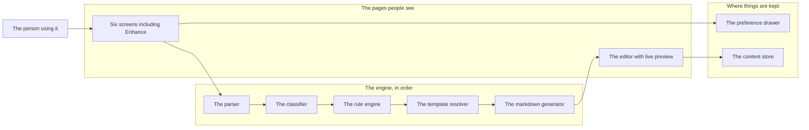
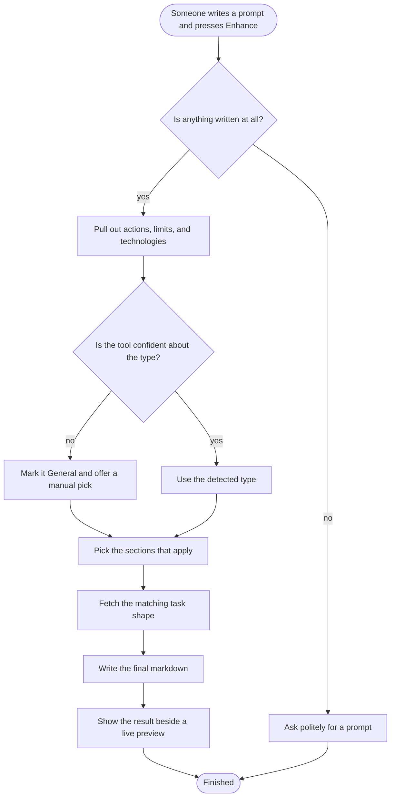
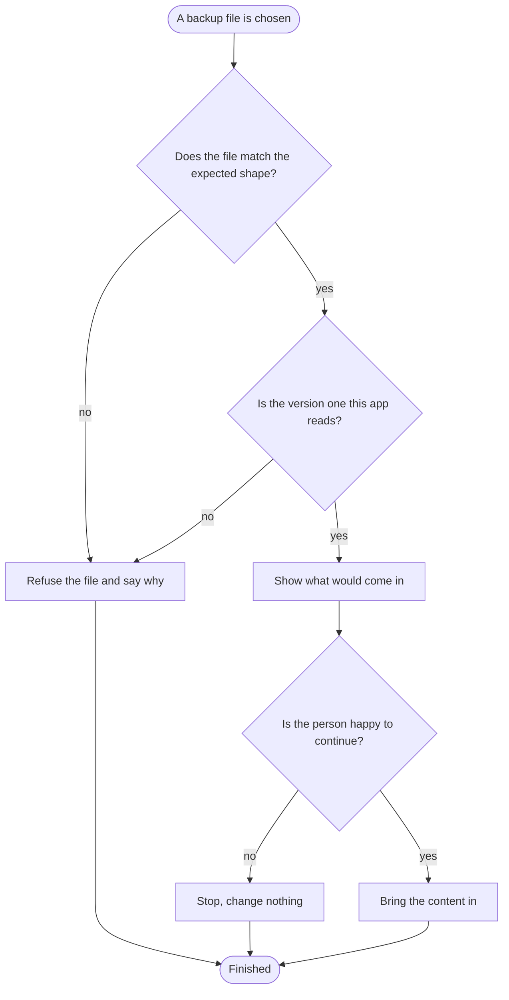
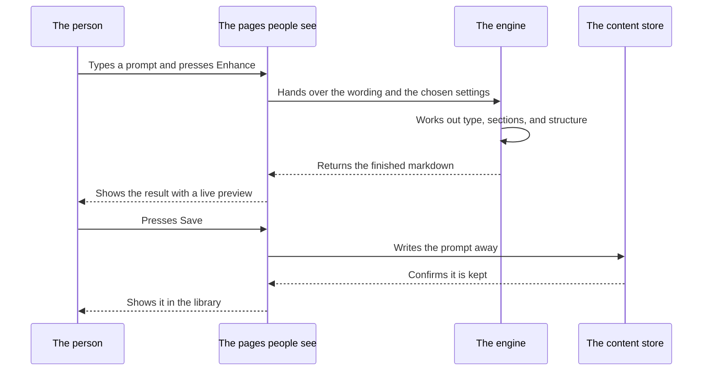
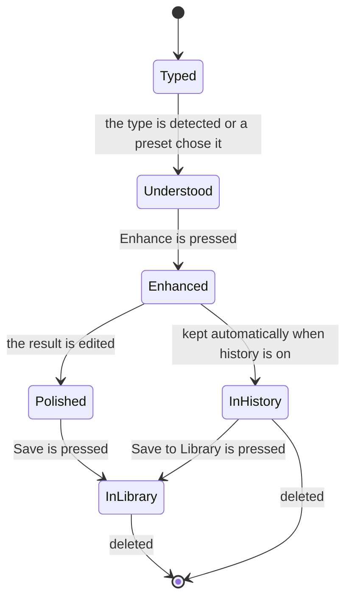

# 06 - DIAGRAMS

[[00 - START HERE|Back to start]] · Previous: [[05 - SYSTEM ARCHITECTURE]] · Next: [[07 - DEVELOPMENT ROADMAP]]

Pictures of how this works. Each one has a plain-language reading beneath it, so nothing here depends on being able to read a diagram. All of them describe the proposed arrangement — nothing is built yet ([[05 - SYSTEM ARCHITECTURE]] says why).

## 1. The big picture

**Reading this:** The person works only with the pages on the left. Pressing Enhance sends the wording into the engine, where five parts each do one job in a fixed order: recognise the pieces, name the type, choose the headings, fetch the task shape, write the final document. The finished text lands in the editor, where it can be polished and saved. Beneath everything, two stores: small preferences go to the preference drawer, and content — history, saved prompts, folders — goes to the content store. Nothing connects to the outside world. This matches the arrangement described in [[05 - SYSTEM ARCHITECTURE#How work would pass between them|How work would pass between them]] and the document's own drawing at `prompt-enhancer-detailed-context.md`, lines 1340–1385.

## 2. How a job gets done — enhancing a prompt

**Reading this:** Two doors lead out of the confidence question. A confident classification goes straight through; a doubtful one settles on "General" and hands the person a picker so they can correct it — `prompt-enhancer-detailed-context.md`, lines 401–419. The empty-input door exists because the document requires a polite refusal rather than a broken run, lines 1033–1037. Every step after the fork is the pipeline the document calls its most important milestone, lines 1389–1405.

## 3. How a job gets done — bringing a backup in

**Reading this:** The file has to pass two gates before anything happens — shape first, then version number. Failing either refuses the file outright. Passing both shows a preview and waits for a yes; walking away at that point changes nothing. This is the five-step import gate required at `prompt-enhancer-detailed-context.md`, lines 938–947.

## 4. Who talks to whom, in order — one enhancement, saved

**Reading this:** Time runs downwards. Solid arrows are requests going out; dashed arrows are answers coming back. The engine never speaks to the person directly — everything passes through the pages. The save at the bottom only happens on purpose; the automatic kind, history, skips the asking and writes as soon as an enhancement finishes, when the switch is on (`prompt-enhancer-detailed-context.md`, lines 838–853). Note what is absent from the picture: no arrow ever leaves these four participants. Nothing is sent anywhere.

## 5. The order of the phases

```mermaid
flowchart LR
    p1["Phase 1 - Foundations and the shape of the data"]
    p2["Phase 2 - Understanding what was asked"]
    p3["Phase 3 - Turning understanding into structure"]
    p4["Phase 4 - The workspace people use"]
    p5["Phase 5 - Giving the app a memory"]
    p6["Phase 6 - Control, trust, and every screen size"]
    p7["Phase 7 - Proving it works and shipping it"]

    p1 --> p2
    p2 --> p3
    p3 --> p4
    p4 --> p5
    p5 --> p6
    p6 --> p7
```

**Reading this:** Phase 1 starts; everything else waits for the phase behind it. An arrow means the phase it points at cannot begin until the one before it is done — the workspace has nothing to show until the pipeline exists, and there is nothing to remember until the workspace produces results. The order matches [[07 - DEVELOPMENT ROADMAP]] exactly, which in turn follows the document's own recommended sequence at `prompt-enhancer-detailed-context.md`, lines 1269–1313.

## 6. The life story of a prompt

**Reading this:** A prompt is born typed. Understanding it — automatically or by preset — unlocks the enhancement. From there it can sit in history without any effort, or be polished and saved to the library on purpose. History can still be promoted to the library later. The two ends of the line are deletions; there is no way back from those. Favourites, folders, and tags are labels worn inside the library rather than stops on this journey — the document treats them as attributes of a saved prompt, lines 888–899.
