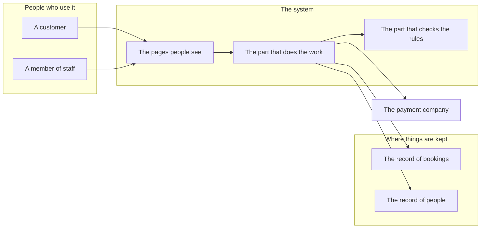
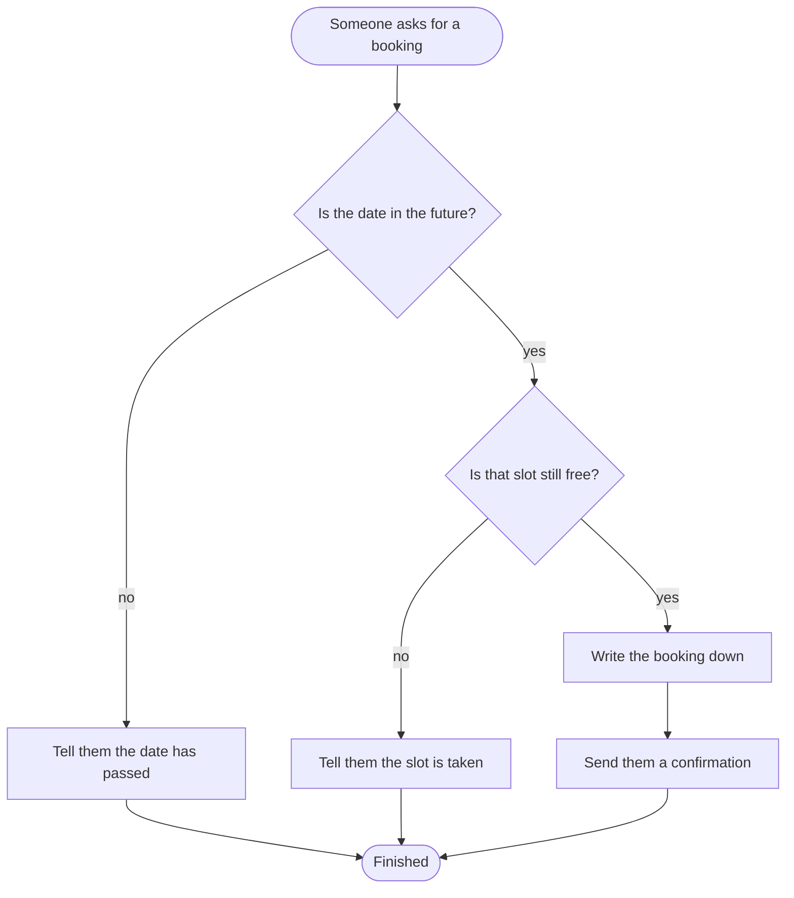
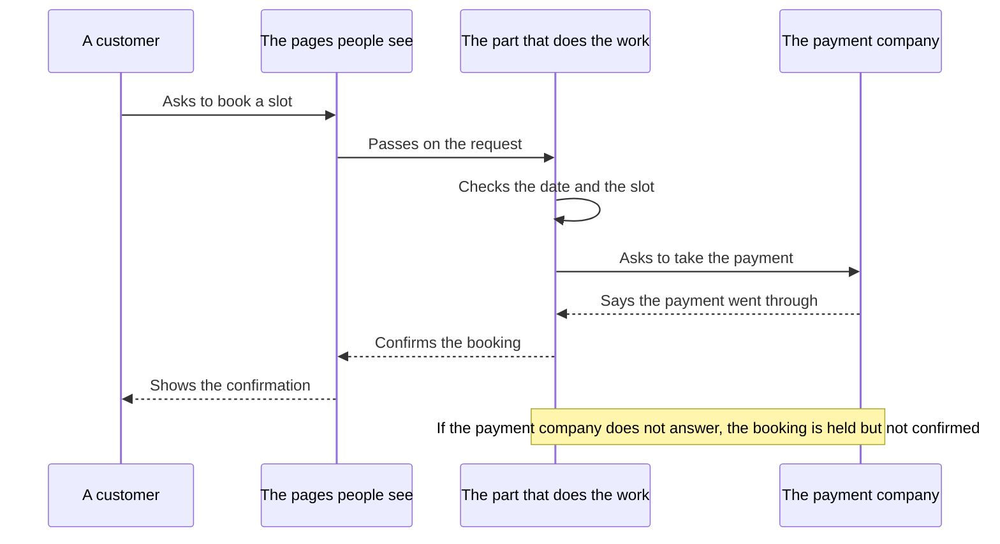
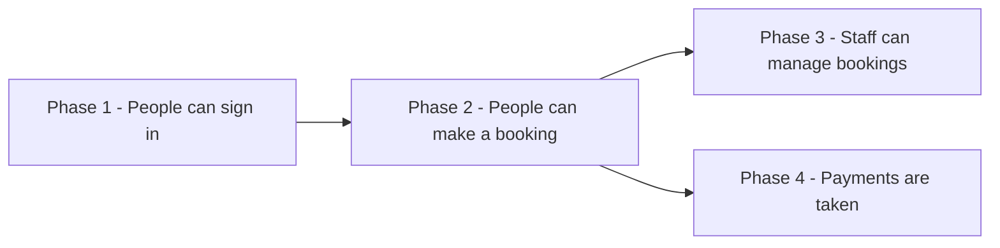
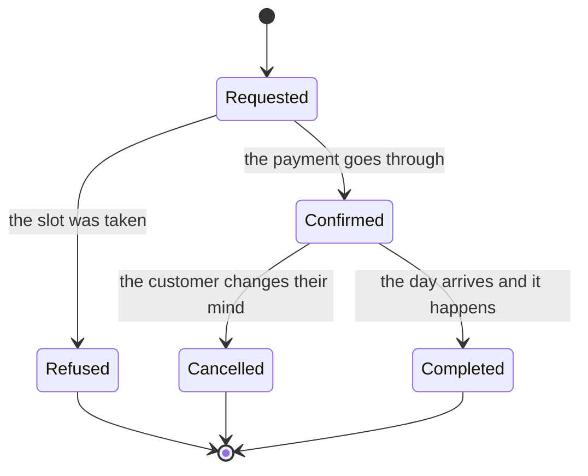
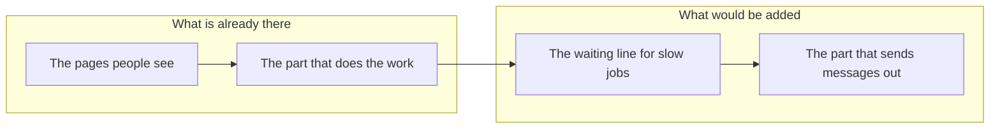

# Diagram Templates

Everything for `06 - DIAGRAMS.md`. All diagrams are Mermaid, because Obsidian draws Mermaid where it stands — no picture files, nothing to open elsewhere.

---

## Rules that keep diagrams from breaking

These are the failures Obsidian actually hits. A diagram that will not draw shows the reader a red error box instead of an explanation, so follow all of them.

1. **Quote every label.** `A["Checks the booking date"]` — not `A[Checks the booking date]`. Quoting makes spaces, commas, full stops, and apostrophes safe in one move.
2. **No brackets inside labels.** Round brackets, square brackets, and curly brackets inside label text break the parser even when quoted. Rewrite the phrase without them.
3. **Plain names for the boxes themselves.** The short name before the bracket — `bookingPage`, `store1` — uses letters and numbers only. No spaces, no punctuation, no accents.
4. **Never name a box `end`, `graph`, `subgraph`, `class`, or `click`.** These are Mermaid's own words. `end` in particular breaks the whole diagram, silently and confusingly.
5. **No emojis inside diagrams.** They render inconsistently and can break the layout. Emojis belong in the trackers, where they are read as text.
6. **Quote edge labels too:** `A -->|"only if the date is free"| B`.
7. **Keep one diagram to about fifteen boxes.** Past that, split it into two diagrams under two headings. A diagram nobody can follow has failed at the one job it had.
8. **Every diagram gets a plain-language reading beneath it.** A short paragraph walking the picture in words. This is not optional — some readers will not take meaning from a picture, and they deserve the same information.
9. **One line per label.** Never press Enter inside a label. If a label truly needs two lines, use `<br>` between them — a raw line break inside quotes is read differently by different versions and is not worth the risk.
10. **No timeline or Gantt charts.** They demand dates, and dates would be invented. The roadmap promises an order, not a calendar.

---

## The diagrams to make

| # | Diagram | Shows | Make it when |
|---|---|---|---|
| 1 | The big picture | The parts and how they connect | Always |
| 2 | How a job gets done | One process, step by step, decisions included | One per main process — always at least one |
| 3 | Who talks to whom, in order | An exchange between parts over time | When something interesting passes between parts |
| 4 | The order of the phases | The roadmap as a picture | Always |
| 5 | The life story of a thing | The states something moves through | When something in the system has states — an order, a booking, an application |
| 6 | The proposed arrangement | What the parts would look like after the changes | When [[05 - SYSTEM ARCHITECTURE]] proposes changes |

---

## 06 - DIAGRAMS.md

````markdown
# 06 - DIAGRAMS

[[00 - START HERE|Back to start]] · Previous: [[05 - SYSTEM ARCHITECTURE]] · Next: [[07 - DEVELOPMENT ROADMAP]]

Pictures of how this works. Each one has a plain-language reading beneath it, so nothing here depends on being able to read a diagram.

## 1. The big picture



**Reading this:** <A short paragraph. Start at the people on the left and walk across to the stores on the right, saying what each part does and what it hands to the next. Matches the description in [[05 - SYSTEM ARCHITECTURE]] — if the two ever disagree, the words win and the picture gets fixed.>

## 2. How a job gets done — <name of the process>



**Reading this:** <Walk the path in words, including what happens at each fork and where each ending leaves the person. Name the file and line each step lives at, so a developer can follow it too.>

<One of these for every main process. Give each its own numbered heading.>

## 3. Who talks to whom, in order — <name of the exchange>



**Reading this:** <Time runs downwards. Say who starts it, what each arrow carries, and what happens if one of them does not answer. Solid arrows are requests going out; dashed arrows are answers coming back — say that in the words, do not assume the reader knows.>

## 4. The order of the phases



**Reading this:** <Say which phase starts, what each one waits for, and which ones could run alongside each other. Matches the order in [[07 - DEVELOPMENT ROADMAP]] exactly. An arrow means the phase it points at cannot start until the phase behind it is done.>

## 5. The life story of a <thing>



**Reading this:** <Say where the thing starts, what moves it from each state to the next, and which states are the end of the line. Point out any state it can never come back from.>

## 6. The proposed arrangement

<Only when [[05 - SYSTEM ARCHITECTURE]] proposes changes. Same shape as the big picture above, showing what it would look like afterwards. Say in the reading which parts are new and which already exist.>



**Reading this:** <Name the new parts, say what each one is for, and say what problem in the arrangement today it fixes. Cite where that problem was found.>
````

---

## Choosing the right picture

| What you are showing | Use |
|---|---|
| Parts and their connections | `flowchart LR` |
| Steps with decisions along the way | `flowchart TD` |
| An exchange between parts, in order over time | `sequenceDiagram` |
| The states something moves through | `stateDiagram-v2` |
| What phase follows what | `flowchart LR` |

Left to right suits arrangements — the eye follows the flow of work across the page. Top to bottom suits processes — the eye follows steps downwards. Both are habits worth keeping, so a reader learns to expect them.

Two shapes carry meaning and are worth using consistently:

- `nodeName(["Rounded text"])` — a beginning or an end
- `nodeName{"A question"}` — a decision, with a labelled arrow out of each answer

Everything else stays a plain box. A diagram with seven shapes needs a key; a diagram with three does not.
